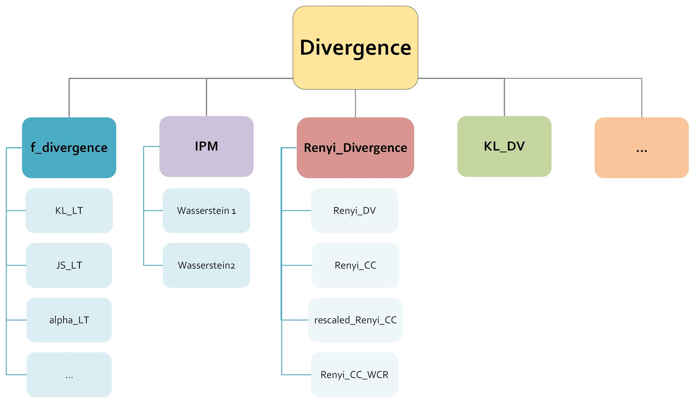

# NeuroDiME: A Software Library on Neural-based Estimation of Divergences and Metrics

## Overview
This repository contains implementations for neural-based estimation of divergences and integral probability metrics (IPM). The implemented methods cover a wide range of divergences, including various f-divergences, and integral probability metrics. You can also view the documentation in HTML files, located in the docs/_build/html directory.

## Class Hierarchy
The structure of the divergence classes is as follows:




## Requirements
Everything was tested on cuda 12.5, cudnn 8.9.2 and ubuntu 22.04
All dependencies are listed in the `requirements.txt` file. To set up the environment, run the following commands:
```bash
# Create a new conda environment
conda create --name <env> python=3.10.4
pip install -r requirements.txt
```

Additionally, you can install packages individually:
```bash
# Install necessary packages
pip install tensorflow
pip install tensorflow_addons
pip install torch
pip install torchvision
pip install torchaudio
pip install torchinfo
pip install torchmetrics
pip install torch-fidelity
pip install jax[cuda12]
pip install flax
pip install pandas
pip install matplotlib
pip install scipy
pip install tqdm
pip install seaborn
```

## Examples
The following are some example use cases available in this repository:
1. **Multivariate Gaussians**: Vary dimension and correlation coefficient (`rho`)
2. **Heavy-tailed distribution**: Varying alpha
3. **Subpopulation detection**: Both synthetic (GMM) and real datasets
4. **Equivariant dataset**: To test on structured data
5. **Image-based tasks**: Divergence estimation with possible CNN-based models
6. **Generation/GAN**: Generating MNIST and CIFAR-10 images

All the examples were tested on one GPU, a 4070 Super with 16GB.
You can find our pretrained models for the Generation/GANs examples in every demos folder.

## Python Files
- `Divergences_tf.py`, `Divergences_torch`, `Divergences_jax`: Contain implementations of all the basic divergence families (the test function/discriminator is an input argument). Can be found in the folder `models`.
- One file for each demonstration example (e.g., `1D Gaussian`, `Mixture of Gaussians`, `Subpopulation detection`, etc.). Can be foudn in the folders tf_demos, torch_demos and jax_demos.

Additionally, gamma function spaces implemented include continuous & bounded, L-Lipschitz, equivariant, and user-defined.

## How to Run
Here are some example commands to run the scripts:
```bash
# Run an N-dimensional Gaussian example with dimension 1
python N_dim_Gaussian_demo.py --sample_size 10000 --batch_size 1000 --epochs 200 --method KLD-DV --use_GP True --dimension 1

# Run an MNIST GAN example
python mnist_gan.py --method KLD-DV --use_GP True --conditional True

# Run an CIFAR-10 GAN example
python cifar10_gan.py --method KLD-DV --use_GP True --conditional True

# Run an biological hypothesis test example
python Divergence_bio_hypothesis_test_demo.py --p 0.01 --method KLD-DV
```

## License
This project is licensed under the terms of the MIT license.
