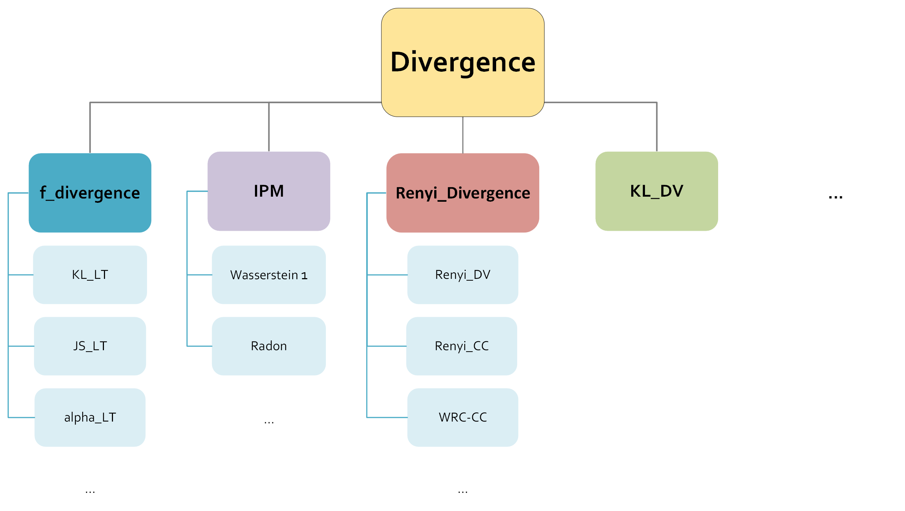

# **NeuroDiME**: A Software Library for Neural-based Divergence and Metric Estimation

### 🔍 **Overview**
**NeuroDiME** is a software library offering neural-based estimation methods for various **divergences** and **integral probability metrics (IPM)**. It supports a wide range of divergences, including several **f-divergences**, and provides an extensive suite of functionalities for estimation and analysis. 

To dive deeper into the documentation, visit our site: [**NeuroDiME Documentation**](https://neurodime.readthedocs.io/en/latest/index.html)

---

## 🌳 **Class Hierarchy**

Our library offers a structured and intuitive class hierarchy for divergence estimation. Below is an illustrative diagram of how different classes interrelate:



---

## 📋 **Requirements**

We tested our library with the following prerequisites:

- **OS**: Ubuntu 22.04
- **CUDA**: 12.5
- **cuDNN**: 8.9.2

All other dependencies are specified in the `requirements.txt`. 

### 🔧 **Quick Setup**
To quickly set up your environment, use the following commands:

```bash
# Step 1: Create a new conda environment
conda create --name neurodime_env python=3.10.4

# Step 2: Install all required packages
pip install -r requirements.txt
```

Alternatively, you can install packages individually:
```bash
pip install tensorflow tensorflow_addons torch torchvision torchaudio torchinfo torchmetrics torch-fidelity
pip install jax[cuda12] flax pandas matplotlib scipy tqdm seaborn
```

---

## 💡 **Examples and Use Cases**

Explore the wide range of example implementations available in NeuroDiME:

1. **Multivariate Gaussians**: Experiment with different dimensions and correlation coefficients (`rho`).
2. **Heavy-tailed Distributions**: Adjust parameters such as `alpha`.
3. **Subpopulation Detection**: Analyze both synthetic (GMM) and real datasets.
4. **Equivariant Datasets**: Test on structured data.
5. **Image-based Tasks**: Utilize CNN-based models for divergence estimation.
6. **Generation/GAN**: Generate images using MNIST and CIFAR-10 datasets.

> 💻 *Note*: All examples have been tested on a single GPU (NVIDIA 4070 Super, 16GB). Pretrained models for Generation/GAN examples can be found within each respective `demos` folder.

---

## 📂 **Core Python Files**

Our implementation is organized into several key files:

- **`Divergences_tf.py`**, **`Divergences_torch.py`**, **`Divergences_jax.py`**: Contain the core implementations for all major divergence families. You can customize these using input arguments for the test functions/discriminators. Find them under the `models` directory.
- **Demonstration Files**: Each demonstration example (e.g., **1D Gaussian**, **Mixture of Gaussians**, **Subpopulation detection**) has a corresponding Python file located in the `tf_demos`, `torch_demos`, and `jax_demos` directories.

NeuroDiME supports various gamma function spaces, including **continuous & bounded**, **L-Lipschitz**, **equivariant**, and **user-defined** functions.

---

## 🚀 **How to Run**

Ready to explore NeuroDiME? Here’s how you can get started with different examples:

```bash
# Example 1: Run an N-dimensional Gaussian with 1 dimension
python N_dim_Gaussian_demo.py --sample_size 10000 --batch_size 1000 --epochs 200 --method KLD-DV --use_GP True --dimension 1

# Example 2: Train a GAN on the MNIST dataset
python mnist_gan.py --method KLD-DV --use_GP True --conditional True

# Example 3: Train a GAN on CIFAR-10
python cifar10_gan.py --method KLD-DV --use_GP True --conditional True

# Example 4: Load a pre-trained GAN model trained on the MNIST dataset
python mnist_gan.py --method KLD-DV --use_GP True --conditional True --load_model True

# Example 5: Run a biological hypothesis test
python Divergence_bio_hypothesis_test_demo.py --p 0.01 --method KLD-DV 
```

---

## 💬 **Support**

If you encounter any issues or have questions, feel free to open an issue on GitHub. We also welcome suggestions and feedback to improve the library!

---

## 📧 **Contact**

For further inquiries, reach out to us at:

- Email: [a.aggelakis@iacm.forth.gr](a.aggelakis@iacm.forth.gr)

---

## 👥 **Contributors**

The development of **NeuroDiME** is based on the research presented in our paper. The contributors are:

- [**Alexandros Angelakis**](https://aangelakis.github.io/) - (University of Crete, IACM-FORTH)
- [**Yannis Pantazis**](https://sites.google.com/site/yannispantazis/) - (University of Crete, IACM-FORTH)
- [**Jeremiah Birrell**](https://scholar.google.co.uk/citations?user=R60hJGUAAAAJ&hl=en) - (Texas State University)
- [**Markos Katsoulakis**](https://scholar.google.com/citations?user=2PpEwFQAAAAJ&hl=el) - (University of Massachusetts)

---

## 📄 **License**

This project is released under the **MIT License**, granting you the freedom to use, modify, and distribute the software. For more details, refer to the `LICENSE` file.

---

Feel free to reach out if you have any questions or suggestions. Enjoy using **NeuroDiME**! 🎉
